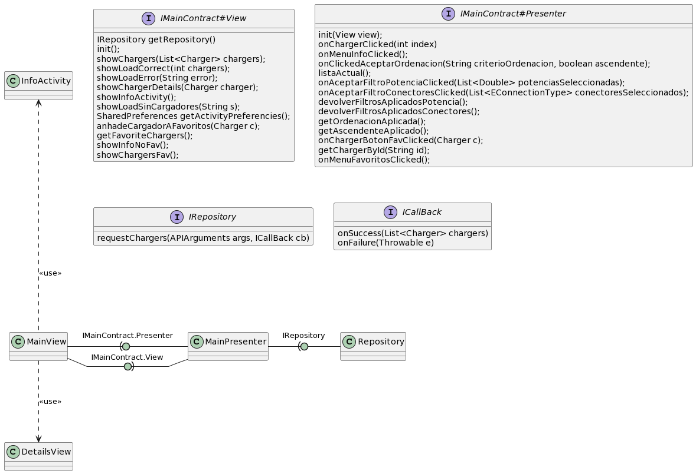

# Proyecto Base Grupo 1

Este repositorio contiene el código inicial para el Proyecto Integrado 2023.

La información relativa al Proyecto Integrado, y las asignaturas que lo componen, se puede encontrar en este [ReadTheDocs](https://proyecto-integrado-ingenieria-del-sw.readthedocs.io/es/latest/index.html)

La aplicación inicial incluye funcionalidad básica para descargar y mostrar información sobre cargadores de coches eléctricos, utilizando el servicio [OpenChargeMap](https://openchargemap.org/site/develop/api#/)

La aplicación utiliza el patrón Model-View-Presenter. El diagrama de arquitectura inicial es el siguiente:

